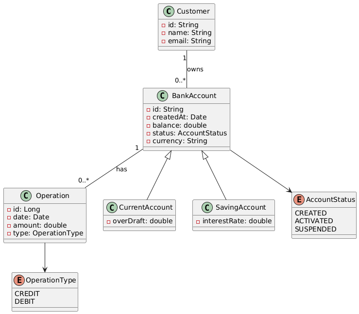
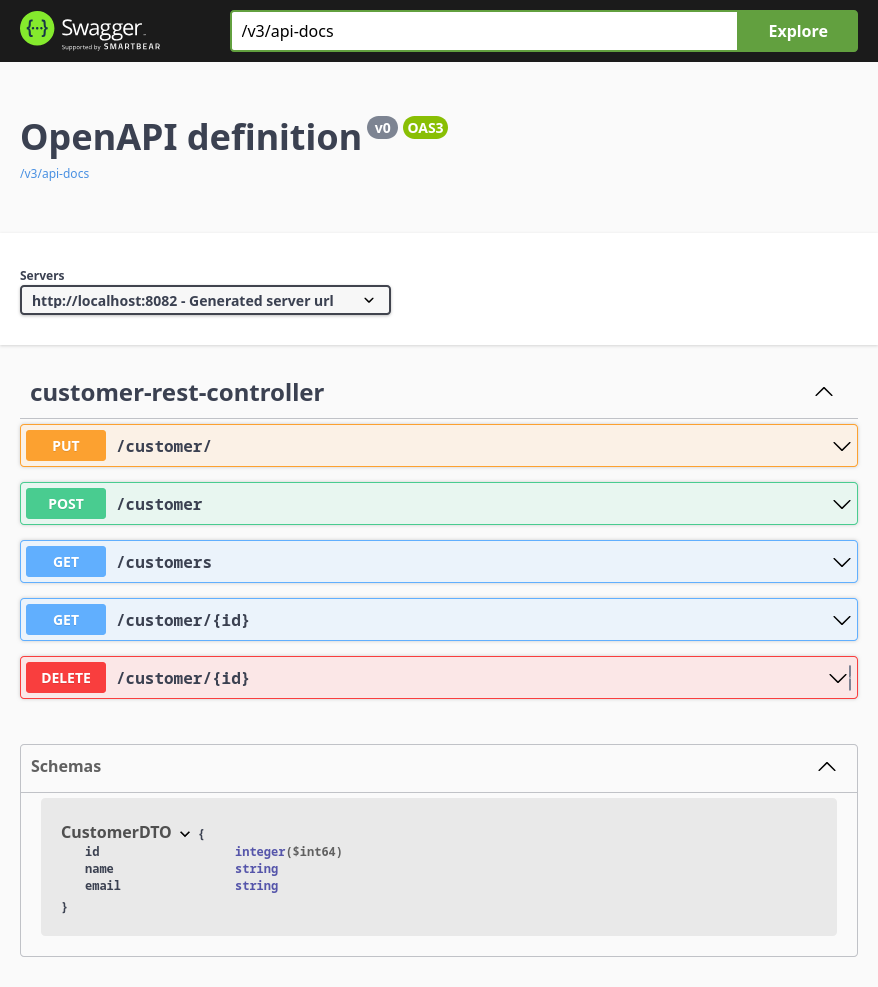

# Digital Banking System

## Overview

The Digital Banking App is a project designed to simulate the core functionalities of a banking application. It provides features for managing customer accounts, performing transactions, and tracking account balances.

## Database Model



## Project Structure

- **Controllers**: Handle HTTP requests and responses.
- **Services**: Contain the business logic of the application.
- **Repositories**: Interact with the database for CRUD operations.
- **Entities**: Represent the data models used in the application.

## How to Run

1. Clone the repository:
   ```bash
   git clone <repository-url>
   ```
2. Navigate to the project directory:
   ```bash
   cd digital-banking
   ```
3. Build the project:
   ```bash
   mvn clean install
   ```
4. Run the application:
   ```bash
   mvn spring-boot:run
   ```
5. Access the application at `http://localhost:8082`.

## API Endpoints

